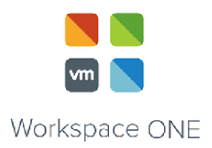

# PowerShell Module for VMware Workspace One Access

## Summary

PowerShell Module to interact with the [VMware Workspace One Access](https://blogs.vmware.com/euc/2019/08/workspace-one-access.html) API. More details can be found in this blog post [here](https://www.virtuallyghetto.com/2020/02/workspace-one-access-vidm-powershell-module-to-automate-creating-3rd-party-identity-provider.html).

## Prerequisites
* [PowerCLI 12.0](https://code.vmware.com/web/tool/12.0.0/vmware-powercli) or newer
* VMware Cloud on AWS scoped [Refresh Token](https://docs.vmware.com/en/VMware-Cloud-services/services/Using-VMware-Cloud-Services/GUID-E2A3B1C1-E9AD-4B00-A6B6-88D31FCDDF7C.html)

## Functions

* Connect-VmcNotification
* Get-VmcNotificationEvent
* Get-VmcNotificationWebhook
* New-VmcNotificationWebhook
* Remove-VmcNotificationWebhook
* Test-VmcNotificationWebhook